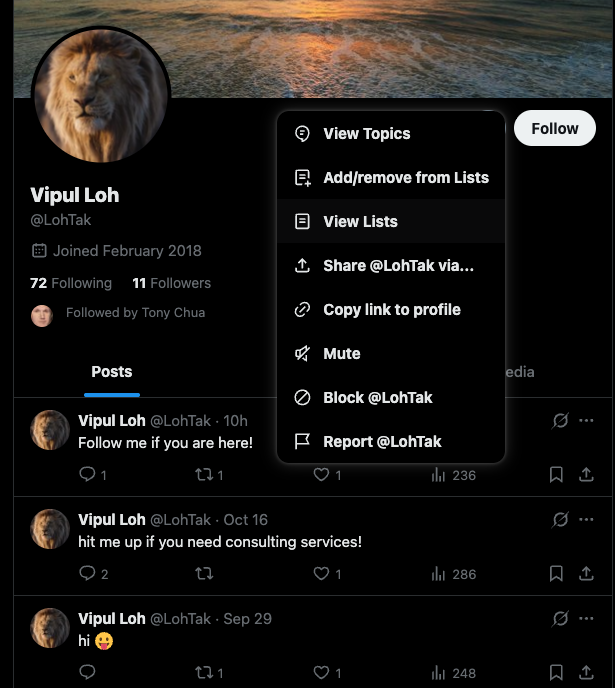
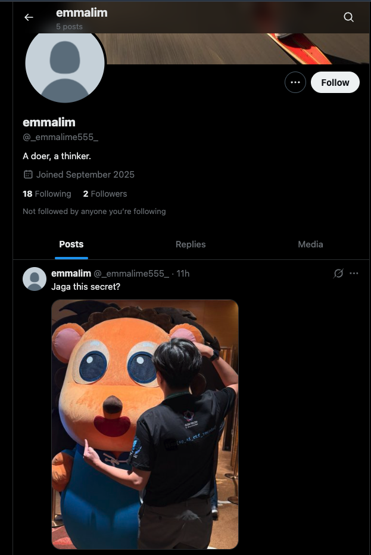

# LionRoar2

### Approach

Same LLM-osint chall with more red herrings.

Learning from the previous challenge, first try to gather information about people behind the project:

After wasting some time on LinkedIn red herrings, I finally locked in on this "Vipul Loh" guy who apparently has an X account. Simply search "Vipul Loh" on X and you can find the account.

Next, just trial and error, do treasure hunt on X to find more information.

On his profile, click the "..." sign and then "View Lists", you can find a list that this account is part of, with some other followers

"emmalim" is a user that we have not seen before, so check out the profile:

The secret string is the one printed on the event shirt, wow. Submit that to the LLM to claim the flag.
