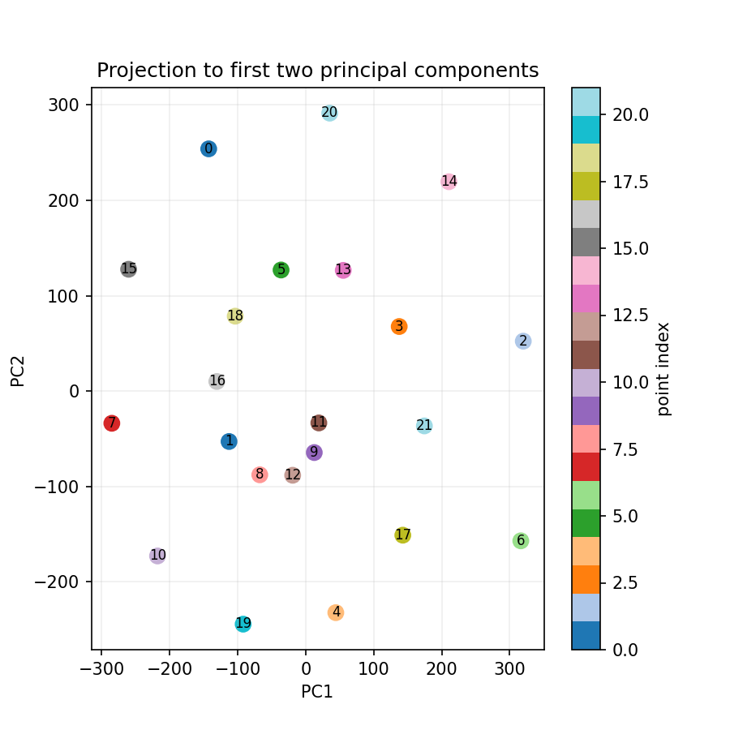

# Spiral

Marina Bay is quiet after the NDP fireworks. Under the glow of the Helix Bridge, security analysts pick up a strange data dump from an old sensor node: streams of numbers, logged just before midnight. On the security console it looks like random noise, but an intercepted chat from the threat actor hints otherwise:

"Line it up along maximum variance where everyone can see it. The shape will give us away."

Your brief arrives:

Mission: You've obtained challenge_embeddings.npy. Somewhere inside is a hidden flag left by the adversary. They're known for hiding messages in shapes inspired by Singapore landmarks: the double-helix of the bridge, the spirals you see looking up the Fort Canning staircase, even the swirl of the Jewel Rain Vortex.

Reduce, decode, visualize, and the flag will spiral into view.

Get the files here: https://spiral-speak.aictf.sg/

Free hints:

Two lines trace a path like the Circle Line around the Bay, but a third carries the station names — hidden not in ink, but in code.

The embeddings are high-dimensional, but the message lives in a lower space. Look for the directions of maximum variance.

Each point may represent more than just a coordinate. Decimals become dialogue.

### Approach

(note: did not solve on spot, up-solved it after))

First, from the description, we need to perform PCA (directions of maximum variance / reduce to lower dimension space). Calculate the first 2 principle components of the embeddings, then represent each point with these 2 directions, use them as coordinated to plot a graph, we see a spiral shape:

The remaining hints in the challenge are misleading (especially "decimals become dialogue" hints towards looking at certain decimals, i.e. fractional part of numbers to find hidden message). We should have come to the logical conclusion, that what the spiral reveals is an order: from the center of the spiral out, the order is 11, 9, 12, ... and so on.

And, an important step to solve this type of challenge should be data analysis - find what's special about the data. In the original embeddings, there is one particular dimension that has numbers much larger than other dimensions. These numbers, when rounded to integer, are actually ASCII for flag characters.

See display_np.py, simply print out those ASCII characters in the spiral order to recover the flag.

Flag: `AI2025{SEE_THE_SP1R4L}`
