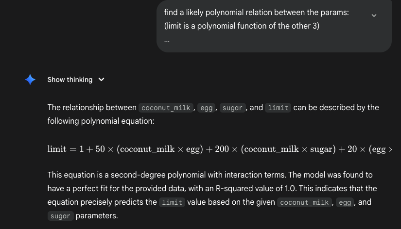

# Limit Theory

Mr Hojiak has inherited a kaya making machine that his late grandmother invented. This is an advanced machine that can take in the key ingredients of coconut milk, eggs, sugar and pandan leaves and churn out perfect jars of kaya. Unfortunately, original recipe is lost but luckily taste-testing module is still functioning so it may be possible to recreate the taste of the original recipe.

The machine has three modes experiment, order and taste-test. The experimental mode allows you to put in a small number of ingredients and it will tell you if the mixture added is acceptable. In order to make great jars of kaya, you have to maximise the pandan leaves with a given set of sugar, coconut milk, and eggs to give the best flavor. However, using too many pandan leaves overwhelms the kaya, making it unpalatable.

Production mode with order and taste-test to check the batch quality will use greater quantities, but because of yield loss, the machine will only be able to tell you the amounts of sugar, coconut milk and eggs that will be used before infusing the flavor of pandan leaves. Plan accordingly.

API: <https://limittheory.aictf.sg:5000>

<https://limittheory.aictf.sg>

### Solution

First, write a script that uses binary search to find the limit (rounded to int) given the 3 inputs.

Next, goal is to find the exact mathematical function between the inputs and the limit. I tried using a neural network, but it could not solve exactly because it overestimates the complexity of the equation.

Eventually, I just submitted the data to gemini, and it could find the quadratic equation through some trial and error.

