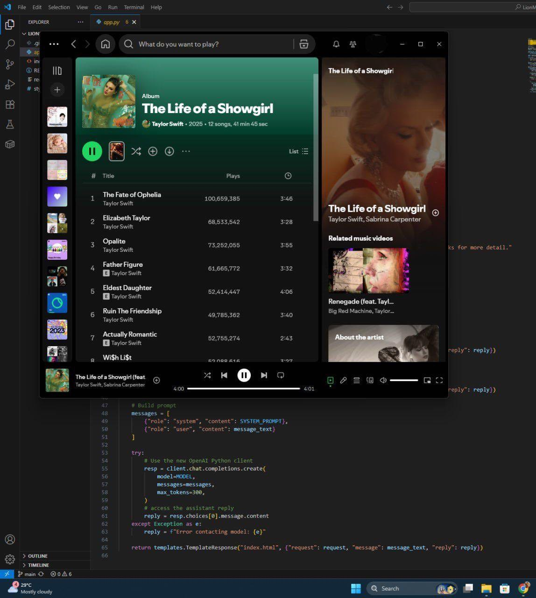
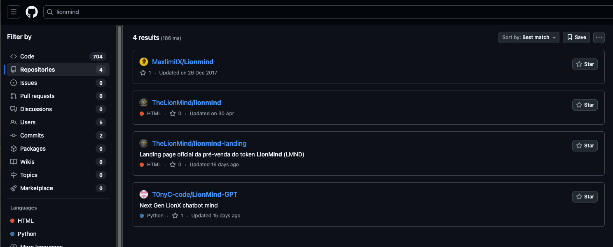
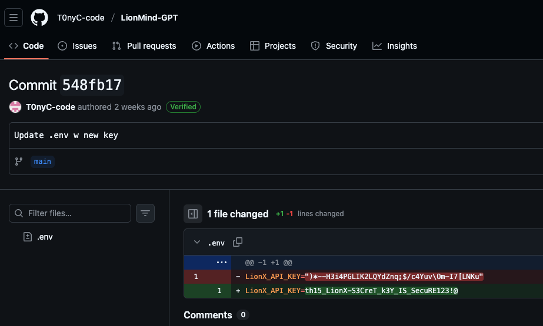

# LionRoar

LLM-osint challenge. There is a website to interact with an LLM that has a "Lion" personality and provides information for some SG60 event.

### Approach

Interact with LLM to gather information, and discover there are some people behind this project.

One person is called "Tony Chua" and further interaction reveals his X handle, @tony_chua_dev

OSINT time! He has one post on X that contains this image:

The code revealed in this image are too generic to yield good search results on GitHub. However, there is a very tiny detail on the image. Can you spot it?

On the top right corner, that's part of the project name - "LionM"

Let ask the LLM about this name! Simply ask "Tell me more about project LionM", it will tell you that the project name is LionMind-GPT

Now we have enough information to find the GitHub repo:

Check the commit history and one of the commits contain an API key! Hand the key back to the LLM and it provides the flag.

